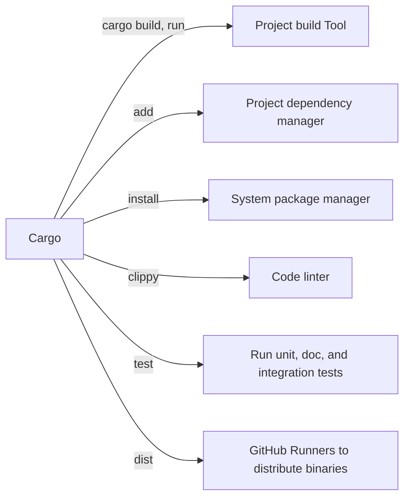

These notes are taken by [Lynn Pepin](https://lynndotpy.xyz/) as personal notes and later reference. There are many abridged Rust texts, and this one is mine.

I abridge [the original work by Steve Klabnik and Carol Nichols, with contributions from the Rust Community](https://doc.rust-lang.org/stable/book/),* with additions from the Cargo book by TODO, the Rust Necronomicon by TODO, and the Rust-by-Example by TODO.

If you have Rustup installed, **you have the full documentation, available offline!** Run `rustup doc` to open the book, `rustup doc --cargo` to open the Cargo book, and `rustup doc -h` to see a full list of available docs.

Chapter names are taken from from [the videogame Celeste](https://celeste.ink/wiki/Main_Page). Each chapter will cite the source material with plenty of links for deeper reading. *Celeste fans, consider these links "the B sides".*

For further reading

- [The Rust Book](https://doc.rust-lang.org/stable/book/) is the golden text, and is available offline with `rustup doc`.
- There are many other books and official resources:
  - [Rust by Example](https://doc.rust-lang.org/stable/rust-by-example/) is the silver text, providing Rust by examples, and is avilable offline with `rustup doc --rust-by-example`
  - [The Cargo Book](https://doc.rust-lang.org/cargo/) will provide you all the details you need to know on Cargo.
  - Is available offline with `rustup doc --cargo`
  - [The Rust Necronomicon](https://doc.rust-lang.org/nomicon/) will teach you about Unsafe Rust. The [first chapter](https://doc.rust-lang.org/nomicon/meet-safe-and-unsafe.html) is illustrative of the deeper nature of Rust, and is available offline with `rustup doc --nomicon`.
  - [The Rust playground](https://play.rust-lang.org/?version=stable&mode=debug&edition=2021) provides you a way to run Rust in your browser, instantly...
  - ... But you can install it locally with `curl --proto '=https' --tlsv1.2 -sSf https://sh.rustup.rs | sh`.
- There are a plethora of third-party resources. Here are some of the best:
  - [Learn X in Y Minutes](https://learnxinyminutes.com/docs/rust/) has a page which thoroughly introduces the Rust language.
  - The [cht.sh](cht.sh) cheat-sheets are excellent and `curl`-friendly as always.
    - [`curl cht.sh/cargo`](https://cht.sh/cargo) -- a list of common `cargo` examples and use cases.
    - [cht.sh/rust/:list](https://cht.sh/rust/:list)provides a list of other Rust cheat sheets.
    - [`curl cht.sh/rust/Basics`](https://cht.sh/rust/Basics) -- a basic Rust example
    - [`curl cht.sh/rust/ControlFlow`](https://cht.sh/rust/ControlFlow) -- Rust `for`, `if`, `whle`, and `loop`.
    - [`curl cht.sh/rust/PatternMatching`](https://cht.sh/rust/PatternMatching) -- Rust `match`
    - [`curl cht.sh/rust/Types`](https://cht.sh/rust/Types) -- Rust `struct`, `enum`, and `traits`
    - [`curl cht.sh/rust/tests`](https://cht.sh/rust/tests) -- Rust unit tests
    - [`curl cht.sh/rust/rosetta/:list`](https://cht.sh/rust/rosetta/:list) -- A huge list of 450 Rust example implementations of the [Rosetta Code challenge](https://rosettacode.org/wiki/Category:Rust), for example, [implementing and solving a Maze](https://cht.sh/rust/rosetta/Maze-solving)


# *Prologue* -- Foreward and getting started

*Referenced texts: The Foreward, Introduction, and "Getting Started" sections of pThe Rust Book](https://doc.rust-lang.org/stable/book/)*.

> **tldr:** `curl https://sh.rustup.rs -sSf | sh`

> In lieu of [the original foreward in the original Rust book](https://doc.rust-lang.org/stable/book/foreword.html), I want to explain my motivations behind using Rust.
> 
> 1. Because it's [*fucking awesome*](https://www.smbc-comics.com/index.php?db=comics&id=2088).

If you're here, it's because you already know Rust and need a refresher, or because you're already convinced it's good. There are other places to learn the virtues of Rust!

Personally, I look forward to a future where C# and Java are languages used by strange hobbyists, Python finally has a good package managing standard, and Rust is superceded by languages which are *even better*.

Here is how to install Rust, and a number of great tools. This assumes you're on MacOS or Linux. (Windows users, figure it out yourself. Sorry!)

```sh
# Install Rust
curl https://sh.rustup.rs -sSf | sh

# Install all the other toolings you might like
# use `cargo binstall` if you want to install binaries without compiling
cargo install cargo-binstall  

# create a new project
cargo new howdy_world # creates a new project at ./howdy_world 

cd howdy_world
cargo run # build and run

# todo: there's a lot of great rust cli tools to install. should i list them here?
```


# *Forsaken City* -- Cargo and Programming Concepts

## Cargo

*Referenced texts: ["Hello, Cargo!" from the Rust book](https://doc.rust-lang.org/stable/book/ch01-03-hello-cargo.html) and [The Cargo Book](https://doc.rust-lang.org/cargo/).

> **tldr tldr:** You installed Rust? You have `cargo`. Use `cargo new project_name` and get crackin.
> 
> 
> **tldr:** Use your IDE to *write* Rust code. Use `git` to source-control Rust code. For *everything else*, use `cargo`.
> 
> Cargo is your build tool, project dependency manager, system package manager, linter, test runner, and with [`cargo-dist`](https://github.com/axodotdev/cargo-dist), your CI/CD binary distributor. Cargo is installed alongside `rustup` and is standard for all Rust development.
> 
> Use `cargo new project_name` to create your project. Use `cargo run` to build and run your project, and use `cargo run -- --foo --bar` to run with project flags.
> 
> When it comes time to publish, [create an API token on crates.io](https://crates.io/), use `cargo login` to add the token to your system, and use `cargo publish` once you're sure and ready. [Full instructions for publishing to crates.io are here](https://doc.rust-lang.org/cargo/reference/publishing.html)
> 
> If you need a reminder on usage, `cargo help` is great, and [cht.sh](https://cht.sh/cargo) is a fantastic cheatsheet as always, and is accessible with `curl cht.sh/cargo`.
> 
> If you want to learn more, run `rustup doc --book` to open [the Rust book](https://doc.rust-lang.org/stable/book/) or `rustup doc --cargo` to open [the Cargo book](https://doc.rust-lang.org/cargo/).


Remember when I said "Rust is fucking awesome"? I was talking about `cargo`. If you were ever frustrated with `pip` or `npm` or `yum` or `apt` or `pac` or `brew`, then lower your apprehensions and get ready to eat good. Cargo is the thing which will spoil all other development for you.

Cargo is your Rust project multitool and you'll wish you had something like it for every language. You will likely never invoke `rustc` directly for Rust compilation.


Specifically, `cargo` is:

1. A build tool with `cargo build` and `cargo run`
2. A project dependency library manager with `cargo add`
3. A system-wide binary with `cargo install`
4. A linter with `cargo clippy`
5. A test runner with `cargo test`
6. And more, with plugins like [`cargo-dist`](https://github.com/axodotdev/cargo-dist) which builds and redistributes binaries




By convention, Rust projects managed with Cargo have a structure like this:

```
.
│   # cargo.toml: The config you edit! A-la npm's package.json
│   # cargo.lock: Don't touch this, but you can git commit it. A-la nmpm's package.lock
├── Cargo.lock
├── Cargo.toml
│ 
│   # source code; default executable lives in main.rs
├── src/
│   ├── lib.rs
│   ├── main.rs
│   └── bin/
│       ├── named-executable.rs
│       ├── another-executable.rs
│       └── multi-file-executable/
│           ├── main.rs
│           └── some_module.rs
│ 
│   # benches/ are benchmarks, optional
├── benches/
│   ├── large-input.rs
│   └── multi-file-bench/
│       ├── main.rs
│       └── bench_module.rs
│
│   # examples/ are... examples. optional
├── examples/
│   ├── simple.rs
│   └── multi-file-example/
│       ├── main.rs
│       └── ex_module.rs
│
│   # tests/ are _integration tests_. unit tests and doctests live in source code.
│   # Use `cargo test` to run unit, doc, and integration tests.
└── tests/
    ├── some-integration-tests.rs
    └── multi-file-test/
        ├── main.rs
        └── test_module.rs
```


The Cargo book has a section on [continuous integration](https://doc.rust-lang.org/cargo/guide/continuous-integration.html). Love yourself, don't write your GitHub runner by hand, [just use `cargo dist`](https://opensource.axo.dev/cargo-dist/). It takes 10 minutes to set up. It's worth it.

When it comes time to publish to [crates.io](https://crates.io), you need to do the following:

1. Log in to [crates.io](https://crates.io/) with GitHub.
2. [Go to Account Settings > API Tokens](https://crates.io/settings/tokens) to create a token,
3. Use `cargo login` to associate the API token with your account.
4. Then, set up your project `Cargo.toml` with the `license`, `description`, `homepage`, `documentation`, `repository`, and `readme` fields at minimum.

Keep in mind: A published crate can not be revoked! [Full instructions for publishing to crates.io are here](https://doc.rust-lang.org/cargo/reference/publishing.html)
