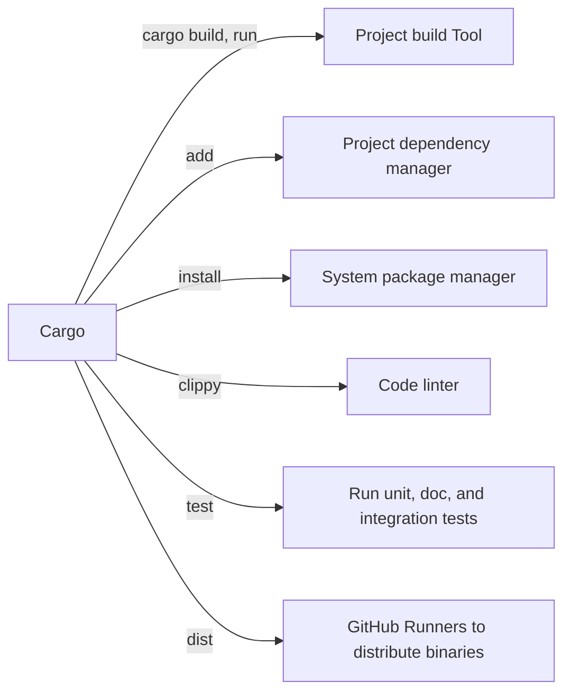

These notes are taken by [Lynn Pepin](https://lynndotpy.xyz/) as personal notes and reference. There are many abridged Rust texts, and this one is mine. These notes will be expanded _as I learn_. I certainly have no authority to explain Rust's macros, unsafe usage, or adhering to the C ABI.

I "abridge" [the original work by Steve Klabnik and Carol Nichols, with contributions from the Rust Community](https://doc.rust-lang.org/stable/book/),* with additions from [the Cargo book](https://doc.rust-lang.org/cargo/), the [Rust Necronomicon](https://doc.rust-lang.org/nomicon/), [Rust by Example](https://doc.rust-lang.org/rust-by-example/), and more.

If you have Rustup installed, **you have the full documentation, available offline!** Run `rustup doc` to open the book, `rustup doc --cargo` to open the Cargo book, and `rustup doc -h` to see a full list of available docs.

Chapter names are taken from from [the videogame Celeste](https://celeste.ink/wiki/Main_Page). Each chapter will cite the source material with plenty of links for deeper reading :)


For further reading *(or as Celeste fans call them, the "B sides"*),

- [The Rust Book](https://doc.rust-lang.org/stable/book/) is the golden text, and is available offline with `rustup doc`.
- There are many other books and official resources:
  - [Rust by Example](https://doc.rust-lang.org/stable/rust-by-example/) is the silver text, providing Rust by examples, and is avilable offline with `rustup doc --rust-by-example`
  - [The Cargo Book](https://doc.rust-lang.org/cargo/) will provide you all the details you need to know on Cargo.
  - Is available offline with `rustup doc --cargo`
  - [The Rust Necronomicon](https://doc.rust-lang.org/nomicon/) will teach you about Unsafe Rust. The [first chapter](https://doc.rust-lang.org/nomicon/meet-safe-and-unsafe.html) is illustrative of the deeper nature of Rust, and is available offline with `rustup doc --nomicon`.
  - [The Rust playground](https://play.rust-lang.org/?version=stable&mode=debug&edition=2021) provides you a way to run Rust in your browser, instantly...
  - ... But you can install it locally with `curl --proto '=https' --tlsv1.2 -sSf https://sh.rustup.rs | sh`.
- There are a plethora of third-party resources. Here are some of the best:
  - [Learn X in Y Minutes](https://learnxinyminutes.com/docs/rust/) has a page which thoroughly introduces the Rust language.
  - The [cht.sh](cht.sh) cheat-sheets are excellent and `curl`-friendly as always.
    - [`curl cht.sh/cargo`](https://cht.sh/cargo) -- a list of common `cargo` examples and use cases.
    - [cht.sh/rust/:list](https://cht.sh/rust/:list)provides a list of other Rust cheat sheets.
    - [`curl cht.sh/rust/Basics`](https://cht.sh/rust/Basics) -- a basic Rust example
    - [`curl cht.sh/rust/ControlFlow`](https://cht.sh/rust/ControlFlow) -- Rust `for`, `if`, `whle`, and `loop`.
    - [`curl cht.sh/rust/PatternMatching`](https://cht.sh/rust/PatternMatching) -- Rust `match`
    - [`curl cht.sh/rust/Types`](https://cht.sh/rust/Types) -- Rust `struct`, `enum`, and `traits`
    - [`curl cht.sh/rust/tests`](https://cht.sh/rust/tests) -- Rust unit tests
    - [`curl cht.sh/rust/rosetta/:list`](https://cht.sh/rust/rosetta/:list) -- A huge list of 450 Rust example implementations of the [Rosetta Code challenge](https://rosettacode.org/wiki/Category:Rust), for example, [implementing and solving a Maze](https://cht.sh/rust/rosetta/Maze-solving)
- [Aria 'Gankra' Beingessner's blog *Faultlore*](https://faultlore.com/blah/) is an excellent introduction to Rust by someone who was there in front of the train laying down the tracks. She wrote most (all?) of the the Rustonomicon, and her writing style and technical depth is something I can only aspire to. You'll have a good time reading a funny blogpost and suddenly you leave with a technical understanding of something far deeper than you have any idea what to do with. Specifically,
  - ["C isn't a programming language anymore"](https://faultlore.com/blah/c-isnt-a-language/) illustrates the viscera of Rust's operation from a perspective you won't get while programming it.
  - ["Why Hashbrown Does A Double-Lookup"](https://faultlore.com/blah/hashbrown-insert/) starts with a re-introduction to a basic datastructure (~~dictionary~~ hashmap my beloved, $\tilde{O}(f(n)) < O(g(n))$ runtime upon me).
  - Also, she works as CTO at [axo.dev](https://axo.dev/) which makes the *excellent* [`cargo-dist` tool](https://opensource.axo.dev/cargo-dist/).


If you read this far, you are part of the Rust community. It is now official. Congratulations / condolences! And remember: **Reading is a way for nerds to procrastinate.**

(that's a joke. literacy is good)

# *Prologue* -- Foreward and getting started

> **tldr:** Rust is good, and you can write Rust before you really understand Rust. Trust me. Install Rust with `curl https://sh.rustup.rs -sSf | sh`

## Foreward...

> ***A forward:*** *In lieu of [the original foreward in the original Rust book](https://doc.rust-lang.org/stable/book/foreword.html), I want to explain my motivations behind learning and using Rust.*
> 
> 1. Because it's [*fucking awesome*](https://www.smbc-comics.com/index.php?db=comics&id=2088).

If you're here, it's because you already know Rust and need a refresher, or because you're already convinced it's good. I was convinced it was good in 2016, and Rust proved itself when it moved into the Linux kernel in 2022, becoming the only language other than C and inline-assembly, after 32 years.

At this point, Rust is *undeniably well-adopted*. Rust is *too important to die*. It won't suffer the same fate as other cool-new-but-barely-used languages like Ada, Zig, D, or Smalltalk.

When I started using Rust, I was gobsmacked by how good the Cargo tooling was in comparison to every other language. The syntax and borrow-checking was a smaller barrier to entry than, say, compiling a C++ project without Docker, or using pip.

Personally, I look forward to a future where C# and Java are languages only used by strange hobbyists, C and C++ are only written in maintenance, Python finally has a good package managing standard, and Rust is considered a historic, influential, and outdated language, superceded by something *even better*.

If you're here but not on the Rust train, consider [Discord's 2020 adoption](https://discord.com/blog/why-discord-is-switching-from-go-to-rust), [Microsoft's 2020 adoption](https://msrc.microsoft.com/blog/2020/04/the-safety-boat-kubernetes-and-rust/), [Google's 2022 Rust insights](https://opensource.googleblog.com/2023/06/rust-fact-vs-fiction-5-insights-from-googles-rust-journey-2022.html), [Torvalds on Rust in the Linux kernel in 2023](https://www.youtube.com/watch?v=OvuEYtkOH88&t=336s). People are *actually* rewriting important projects in Rust, and not just talking about it! Projects like [the fish shell](https://github.com/fish-shell/fish-shell) after 10 years of C++, [core parts of Windows](https://www.theregister.com/2023/04/27/microsoft_windows_rust/) and [Linux](https://lore.kernel.org/rust-for-linux/20231101-rust-binder-v1-0-08ba9197f637@google.com/), parts of [npm](https://www.rust-lang.org/static/pdfs/Rust-npm-Whitepaper.pdf), [the 1Password package manager](https://blog.1password.com/1passwordx-december-2019-release/), much of the Signal libraries and app, etc.

Personally, I rewrote my [Reso circuit esolang in Rust](https://github.com/resolang/reso) just because pip was too painful, [and I got a 2000000% speed increase](https://lynndotpy.xyz/posts/reso-2023/). 

When I started with Rust, I understood very little of it. Like any other language, you can get through walls when you run into them enough, but you might want to start with small projects to build up an immunity to big projects.
## ... And getting started.

*Referenced texts: The Foreward, Introduction, and "Getting Started" sections of pThe Rust Book](https://doc.rust-lang.org/stable/book/)*.

> **tldr:** `curl https://sh.rustup.rs -sSf | sh`


Here is how to install Rust, and a number of great tools. This assumes you're on MacOS or Linux. (Windows users, figure it out yourself. Sorry!)

```sh
# Install Rust
curl https://sh.rustup.rs -sSf | sh

# Install all the other toolings you might like
# use `cargo binstall` if you want to install binaries without compiling
cargo install cargo-binstall  

# create a new project
cargo new howdy_world # creates a new project at ./howdy_world 

cd howdy_world
cargo run # build and run

# todo: there's a lot of great rust cli tools to install. should i list them here?
```


# *Forsaken City* -- Cargo and Programming Concepts

## Cargo

*Referenced texts: ["Hello, Cargo!" from the Rust book](https://doc.rust-lang.org/stable/book/ch01-03-hello-cargo.html) and [The Cargo Book](https://doc.rust-lang.org/cargo/).

> **tldr tldr:** You installed Rust? You have `cargo`. Use `cargo new project_name` and get crackin.
> 
> 
> **tldr:** Use your IDE to *write* Rust code. Use `git` to source-control Rust code. For *everything else*, use `cargo`.
> 
> Cargo is your build tool, project dependency manager, system package manager, linter, test runner, and with [`cargo-dist`](https://github.com/axodotdev/cargo-dist), your CI/CD binary distributor. Cargo is installed alongside `rustup` and is standard for all Rust development.
> 
> Use `cargo new project_name` to create your project. Use `cargo run` to build and run your project, and use `cargo run -- --foo --bar` to run with project flags.
> 
> When it comes time to publish, [create an API token on crates.io](https://crates.io/), use `cargo login` to add the token to your system, and use `cargo publish` once you're sure and ready. [Full instructions for publishing to crates.io are here](https://doc.rust-lang.org/cargo/reference/publishing.html)
> 
> If you need a reminder on usage, `cargo help` is great, and [cht.sh](https://cht.sh/cargo) is a fantastic cheatsheet as always, and is accessible with `curl cht.sh/cargo`.
> 
> If you want to learn more, run `rustup doc --book` to open [the Rust book](https://doc.rust-lang.org/stable/book/) or `rustup doc --cargo` to open [the Cargo book](https://doc.rust-lang.org/cargo/).


Remember when I said "Rust is fucking awesome"? I was talking about `cargo`. If you were ever frustrated with `pip` or `npm` or `yum` or `apt` or `pac` or `brew`, then lower your apprehensions and get ready to eat good. Cargo is the thing which will spoil all other development for you.

Cargo is your Rust project multitool and you'll wish you had something like it for every language. You will likely never invoke `rustc` directly for Rust compilation.


Specifically, `cargo` is:

1. A build tool with `cargo build` and `cargo run`
2. A project dependency library manager with `cargo add`
3. A system-wide binary with `cargo install`
4. A linter with `cargo clippy`
5. A test runner with `cargo test`
6. And more, with plugins like [`cargo-dist`](https://github.com/axodotdev/cargo-dist) which builds and redistributes binaries




By convention, Rust projects managed with Cargo have a structure like this:

```
.
│   # cargo.toml: The config you edit! A-la npm's package.json
│   # cargo.lock: Don't touch this, but you can git commit it. A-la nmpm's package.lock
├── Cargo.lock
├── Cargo.toml
│ 
│   # source code; default executable lives in main.rs
├── src/
│   ├── lib.rs
│   ├── main.rs
│   └── bin/
│       ├── named-executable.rs
│       ├── another-executable.rs
│       └── multi-file-executable/
│           ├── main.rs
│           └── some_module.rs
│ 
│   # benches/ are benchmarks, optional
├── benches/
│   ├── large-input.rs
│   └── multi-file-bench/
│       ├── main.rs
│       └── bench_module.rs
│
│   # examples/ are... examples. optional
├── examples/
│   ├── simple.rs
│   └── multi-file-example/
│       ├── main.rs
│       └── ex_module.rs
│
│   # tests/ are _integration tests_. unit tests and doctests live in source code.
│   # Use `cargo test` to run unit, doc, and integration tests.
└── tests/
    ├── some-integration-tests.rs
    └── multi-file-test/
        ├── main.rs
        └── test_module.rs
```


The Cargo book has a section on [continuous integration](https://doc.rust-lang.org/cargo/guide/continuous-integration.html). Love yourself, don't write your GitHub runner by hand, [just use `cargo dist`](https://opensource.axo.dev/cargo-dist/). It takes 10 minutes to set up. It's worth it.

When it comes time to publish to [crates.io](https://crates.io), you need to do the following:

1. Log in to [crates.io](https://crates.io/) with GitHub.
2. [Go to Account Settings > API Tokens](https://crates.io/settings/tokens) to create a token,
3. Use `cargo login` to associate the API token with your account.
4. Then, set up your project `Cargo.toml` with the `license`, `description`, `homepage`, `documentation`, `repository`, and `readme` fields at minimum.

Keep in mind: A published crate can not be revoked! [Full instructions for publishing to crates.io are here](https://doc.rust-lang.org/cargo/reference/publishing.html)


## Programming concepts, reduxed

*Referenced texts: [Programming a Guessing Game](https://doc.rust-lang.org/stable/book/ch02-00-guessing-game-tutorial.html) and [Common Programming Concepts](https://doc.rust-lang.org/stable/book/ch03-00-common-programming-concepts.html) from the Rust book, [Learn X in Y minutes where X=Rust](https://learnxinyminutes.com/docs/rust/), [Rust by Example](https://doc.rust-lang.org/stable/rust-by-example/),  [the Rust Standard Library](https://doc.rust-lang.org/std/) documentation.

> **tldr:** Rust is an **expression oriented language**, where nearly every piece of code is a block which returns something. This is very similar to functional languages.
> 
> [Review Rust in Y minutes](https://learnxinyminutes.com/docs/rust/) to get a breakdown of the language.
> 
> Rust has no null. Instead, it has `Result<T,E>` with cases `Ok(foo)` and `Err(bar)`, and it has `Option<T>` with cases `Some(foo)` and `None`. These are used extensively, and are the reason you need to `.unwrap()` so many things.

In this section, I'm assuming you already know how to program! **Here are the bare minimums you need to see to start writing your first Rust programs.**
### Cool new friends, `match`, `Result<T,E>` and `Option<T>`

| Return type                                                             | Case if it works           | Case if it doesn't        |
| ----------------------------------------------------------------------- | -------------------------- | ------------------------- |
| [`Result<T, E>`](https://doc.rust-lang.org/std/result/enum.Result.html) | `Ok(foo)` where `foo: T`   | `Err(bar)` where `bar: E` |
| [`Option<T>`](https://doc.rust-lang.org/std/option/enum.Option.html)    | `Some(foo)` where `foo: T` | `None`                    |


Rust has no concept of `null`. Instead, you'll see two common return types `Result<T,E>` and `Option<T>`. Here's an example of `Result<T,E>`, unwrapping, implicit returns, [`match`](https://doc.rust-lang.org/rust-by-example/flow_control/match.html)

```rust
fn parse_int(string: String) -> Option<i64> {
  match string.parse::<i64>() {
    Ok(val) => Some(val),
    Err(_) => None
  }
}

fn main() {
  println!(
    "{} {}",
    parse_int("123".to_string()).unwrap(),
    parse_int("456".to_string()).unwrap(),
  )
}
```

What's going on here? (Well, these are reference notes. I hope you already know!)

In both cases, if you can assume `something()` returning `Result<T,E>` or `Option<T>` passes, you can `something().unwrap()` to get your `T`. In more detail,

1. `string.parse::<i64>()` is type `Result<T,E>`, where `T` is `i64` and `E` is `ParseIntError`.
2. `Result<T,E>` is a return type used when something can fail, and we want to pass the error along.
3. `Ok(val)` is the case for `Result<T,E>` where it succeeds, and `Err(err)` is the case where it fails.
4. We use underscore `_` in `Err(_)` to ignore the provided error.
5. `Option<T>` is a return type when something simply might not exist without being in a failure state.
6. `Some(val)` is the case where `Option<T>` succeeds, and `None` is the case where it fails
7. The [`println!`](https://doc.rust-lang.org/stable/rust-by-example/hello/print.html) is a standard [macro](https://doc.rust-lang.org/stable/rust-by-example/macros.html). Rust's `macro` system allows the definition of syntactic sugar _within Rust_, to allow for `println!` to take multiple arguments.

This is likely similar to how you already use `null`, but with none of the pitfalls. 

### Write unit tests and doc tests! You don't need to learn a separate framework!

> **tldr:** Rust has a built-in test framework. Doctests and unit tests live alongside source. It is great, and you should use it.


```rust
/// Parses a string to an int.
/// 
/// Wraps string.parse::<i64>(), providing Option<i64>
/// rather than Result<i64, ParseIntError>.
/// 
/// # Examples. These are executed with `cargo test`!
/// ```
/// assert_eq!(123, parse_int("123".to_string()).unwrap());
/// ```

fn parse_int(string: String) -> Option<i64> {
  match string.parse::<i64>() {
    Ok(val) => Some(val),
    Err(_) => None
  }
}

fn main() {
  println!(
    "{} {}",
    parse_int("123".to_string()).unwrap(),
    parse_int("456".to_string()).unwrap(),
  )
}

// These are ALSO executed with `cargo test`!
#[cfg(test)]
mod my_cool_tests {
  // Pull everything in from the source scope
  use super::*;
  
  #[test]
  fn it_works() {
    assert_eq!(123, parse_int("123".to_string()).unwrap());
  }
  
  #[test]
  fn it_breaks() {
    assert!(parse_int("one hundred".to_string()).is_none());
  }
}
```


### Oops, you wanted object oriented programming? Okay, fine,

TODO: I'm basically going to show you my implementation of `Number` here: https://github.com/lynnpepin/phantasm/blob/main/src/number.rs


